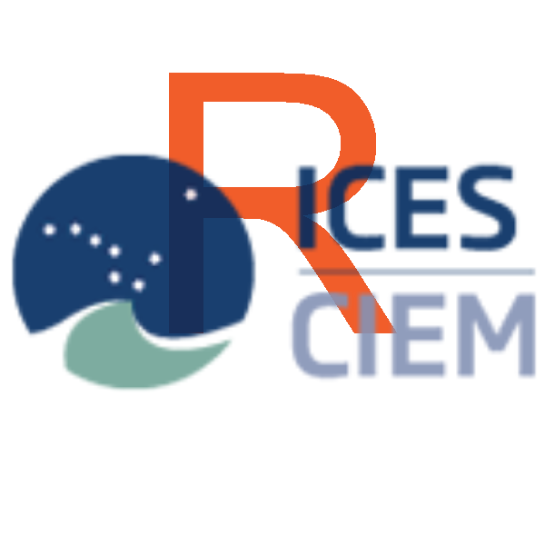
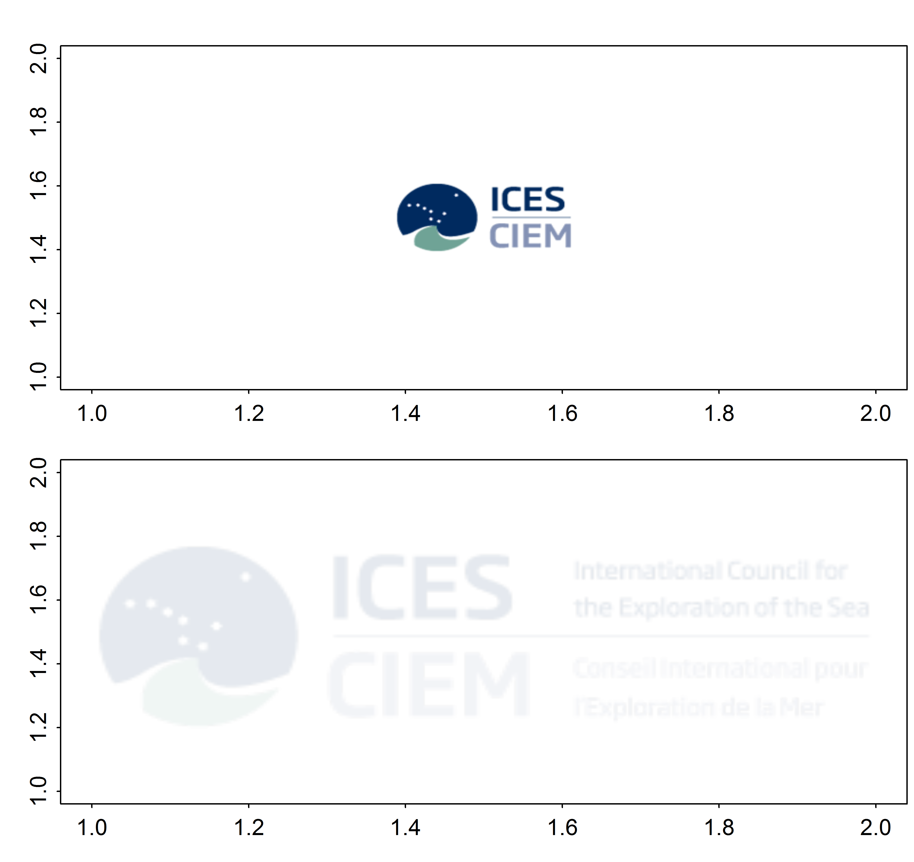

# R for ICES: Linking ICES data, science, and advice with R



## Introduction
The International Council for the Exploration of the Seas (ICES; [ices.dk](http://www.ices.dk/)) is a global organization that develops science and advice to support the sustainable use of the oceans. ICES is a network of over 4000 scientists and efforts to aggregate, analyze, and explore the vast amount of data related to marine ecosystems and resources are extensive and ongoing. A multitude of code already exists on the harddrives of each scientist, however, much of the code (e.g., for aggregating data, calculating survey indices, and  common outputs) is unavailable to other users and efforts are likely overlapping. There is no need to reinvent the wheel and the impetus of the ICES GitHub and the (very much in development) rICES R package is to provide a platform for ICES scientists to share and contribute to the development of common tools and techniques to facilitate the ICES mission. 

Note: users of ICES data products are subject to the [ICES Data Policy](http://www.ices.dk/marine-data/Documents/ICES_Data_Policy_2012.pdf). All code herein is provided without warranty and may be under further development. Please contribute to the development on GitHub ([github.com/ICES-dk](https://github.com/ICES-dk)) or contact the author directly <scott.large@ices.dk>.

## Installation

### Development version
```r
devtools::install_github("ICES-dk/rICES")
library(rICES)
```

## Interacting with the DATRAS API's
Most of the advice that ICES provides relies heavily upon DATRAS and other ICES Data Centre products. The user interfaces of these products are well developed and very user friendly for point-and-click data exploration and accessing a few years or surveys. Users interested in accessing the data in a more transparent, reproducible, and streamlined way can use the following [R](http://cran.r-project.org/) code to download batches of surveys, years, and quarters.

The following function interacts directly with the [ICES DATRAS WebServices](https://datras.ices.dk/WebServices/DATRASWebService.asmx) and is able to extract station data (HH), age data (CA), and length data (HL) and returns each record as an R object. Keep in mind that the speed of this function is limited by bandwidth availability and parsing XML can be a labor intensive task, especially for long time-series. The code is written to parse the XML using parallel processing, which can significantly reduce run-time. The full time series of North Sea IBTS length based data has ~ 3 million rows and can take 30+ minutes to download and parse in parallel.

### Haul Data
To download the haul meta-data from the first and third quarters in 2010 and 2011 of the North Sea International Bottom Trawl Survey, use the following code:
```r 
haulData <- getDATRAS(record = "HH",
                      survey="NS-IBTS",
                      startyear = 2010,
                      endyear = 2011,
                      quarters = c(1,3),
                      parallel = TRUE,
                      cores = 4)
dim(haulData)
```

### Length Data
To download the length-based information from the first quarter in 2000-2001 of the Baltic International Trawl Survey, use the following code:
```r 
lengthData <- getDATRAS(record = "HL",
                      survey="BITS",
                      startyear = 2000,
                      endyear = 2001,
                      quarters = 1,
                      parallel = TRUE,
                      cores = 4)
dim(lengthData)
```

### Age Data
To download the age-based information from all quarters in 1999 of the French Southern Atlantic Bottom Trawl Survey, use the following code:
```r
ageData <- getDATRAS(record = "CA",
                      survey="EVHOE",
                      startyear = 1999,
                      endyear = 1999,
                      quarters = c(1:4),
                      parallel = TRUE,
                      cores = 4)
dim(ageData)
```

The function above returns *data.table* objects, which are able to efficiently handle very large amounts of data. 

## Interacting with the Stock Assessment Database
The ICES Stock Assessment Database data are available for most analytically assessed ICES stocks from 2014 onwards. The first function flr2xml() aims translates stock assessment output (currently only as FLR objects) into the required XML format. The second function getStockSummary() downloads and aggregates the data for all analytical assessments published in a given year. Aggregated stock assessment data can be used to summarize trends over time. 

### FLRobject translated to ICES XML template

provide example here

### Aggregated Stock Assessment data

provide example here

## Plotting functions

### Add ICES logo to a plot
Could be useful to add ICES logo or other .png files to the background of a plot.

```r
library(png)
#
width <- 172.4
height <- 162.6
rows <- 2
cols <- 1
# May not look ideal when viewed in Rstudio or R viewer, but the
# plot should look fine as a .png.
png(filename = "~/TESTlogo.png",
    width = width,
    height = height,
    units = "mm",
    res = 600)
#
par(mar = c(2.15, 2.25, 0.45, 0.25),
    mfrow = c(rows, cols),
    oma = c(0, 0, 1.25, 0),
    mgp = c(3, .35, 0),
#     family = "Calibri", # requires library(extrafont), but matches ICES Advice format
    tck = -0.01)
#
plot(1:2,type="n")
icesLogo(logoType = "acronym", x = 0.5, y = 0.5, size = .25, alpha = 1)
plot(1:2,type="n")
icesLogo(logoType = "fullText", x = 0.5, y = 0.5, size = 1, alpha = .1)
dev.off()

orange <- "#F15D2A"

plot(x = 0.4, y = 0.5,type="p", pch = "R", cex = 5, col = orange, add = T,
xlim = c(0,1), ylim = c(0,1))
icesLogo(logoType = "acronym", x = 0.5, y = 0.5, size = .25, alpha = 1)

```

